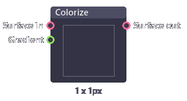
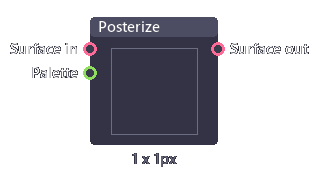
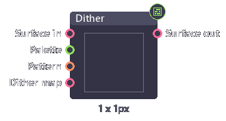

# Coloring

## Colorize

Remap greyscale pixel with user defined gradient.

| Inputs     | Type     | Description      |
| ---------- | -------- | ---------------- |
| Surface in | String   | Image input.     |
| Gradient   | Gradient | Color to map to. |

| Outputs     | Type    | Description   |
| ----------- | ------- | ------------- |
| Surface out | Surface | Image output. |

## Posterize

Average color in an image into palette.

| Inputs     | Type    | Description    |
| ---------- | ------- | -------------- |
| Surface in | String  | Image input.   |
| Palette    | Color[] | Output colors. |

| Outputs     | Type    | Description   |
| ----------- | ------- | ------------- |
| Surface out | Surface | Image output. |

## Dither

Apply dither effect.

| Inputs     | Type    | Description        |
| ---------- | ------- | ------------------ |
| Surface in | String  | Image input.       |
| Palette    | Color[] | Output colors.     |
| Pattern    | Int     | Dither pattern.    |
| Dither map | Surface | Custom dither map. |

| Outputs     | Type    | Description   |
| ----------- | ------- | ------------- |
| Surface out | Surface | Image output. |
