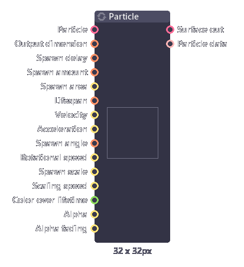
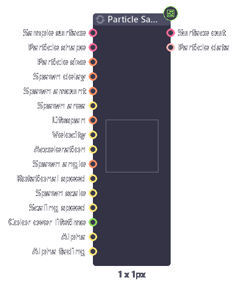
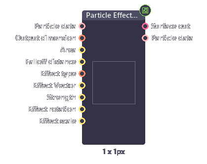

# Particle

## Particle

Generate particle effect from input surfaces.

| Inputs              | Type               | Description                                                  |
| ------------------- | ------------------ | ------------------------------------------------------------ |
| Particle            | Surface, Surface[] | Particle used. - Use surface array to randomize particle. |
| Output dimension    | Int[2]             | Output size.                                                 |
| Spawn type          | Int                | Type of spawning. - **Steam**: spawn particle every given time. - **Burst**: spawn particle once. |
| Spawn delay         | Int                | [Steam] Delay between each particle spawn.                   |
| Spawn frame         | Int                | [Burst] Frame to spawn particle.                             |
| Spawn amount        | Int                | Amount of particle per stream / burst.                       |
| Spawn area          | Float[5]           | Area to spawn.                                               |
| Spawn distribution  | Int                | How particle spawn in the area. - **Uniform**: spawn in the fix grid. - **Random**: random position. - **Border**: spawn only at the border of the area. |
| Lifespan            | Int[2]             | Lifespan of particle (range).                                |
| Velocity            | Float[4]           | Spawn speed of particle (range).                             |
| Acceleration        | Float[2]           | Particle acceleration.                                       |
| Point at center     | Boolean            | Whether to point particle to the center of the area or not.  |
| Spawn angle         | Int[2]             | Angle of the particle to spawn (range).                      |
| Rotational speed    | Float              | Speed that the particle rotate.                              |
| Spawn scale         | Float[4]           | Size of the particle (range).                                |
| Scaling speed       | Float[2]           | How the particle size change overtime.                       |
| Color over lifetime | Gradient           | Color of the particle.                                       |
| Alpha               | Float[2]           | Transparency of the particle (range).                        |
| Alpha fading        | Float              | How fast the particle fade out.                              |

| Outputs       | Type      | Description             |
| ------------- | --------- | ----------------------- |
| Surface out   | Surface   | Image output.           |
| Particle data | Particles | Data used for effector. |

## Particle sampler

Just like particle nodes. But each particle now sample surface from a given surface when it spawned.

| Inputs         | Type    | Description                   |
| -------------- | ------- | ----------------------------- |
| Sample surface | Surface | Surface to sample from.       |
| Particle shape | Surface | Shape of the particle (alpha) |

## Particle Effector

Particle effector takes in particle data, and manipulate them using different algorithm. Allowing you to modify particle after spawn.

| Inputs           | Type     | Description                                                  |
| ---------------- | -------- | ------------------------------------------------------------ |
| Particle data    | Particle | Particle to affect.                                          |
| Output dimension | Float    | Output size.                                                 |
| Area             | Float[5] | Area of effect.                                              |
| Falloff          | Curve    | How effect got weaker near the edge of the area.             |
| Falloff distance | Float    | Width of the falloff.                                        |
| Effect type      | Int      | Type of effect. - Wind: push particle in area in one direction. - Attract: pull all particle to center. - Repel: push particle out of the center. - Vortex: rotate the particle around center. |
| Strength         | Float[2] | Strength of the effect.                                      |
| Effect Vector    | Float[2] | Direction of the force.                                      |
| Effect rotation  | Float    | Rotate the affected particle.                                |
| Effect scale     | Float[2] | Scale the affected particle.                                 |

| Outputs       | Type     | Description    |
| ------------- | -------- | -------------- |
| Surface out   | Surface  | Image output.  |
| Particle data | Particle | Particle data. |

