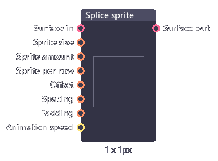
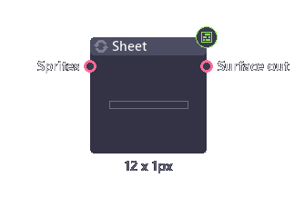

# Working with sprite sheet

Sprite sheet is a single sprite that contain multiple sprites tiled inside. These nodes deal with preparing and creating sprite sheet.

## Splicing sprite sheet

This node takes in a sprite sheet, cuts it into smaller sprites, and outputs an array or animation. 

| Inputs          | Type    | Description                                            |
| --------------- | ------- | ------------------------------------------------------ |
| Surface in      | Surface | Sprite sheet to splice.                                |
| Sprite size     | Int[2]  | Dimensions of each sprite.                             |
| Sprite amount   | Int     | Total amount of sprites in that sheet.                 |
| Sprite per row  | Int     | Amount of sprites per row.                             |
| Offset          | Int[2]  | Offset of the first sprite.                            |
| Spacing         | Int[2]  | Space between each sprite.                             |
| Padding         | Int[4]  | Empty pixels added after the splice on each side.      |
| Output          | Int     | Type of output.  - **Animation** - **Array** |
| Animation speed | Float   | Animation speed.                                       |

| Outputs     | Type    | Description    |
| ----------- | ------- | -------------- |
| Surface out | Surface | Sprite output. |

## Export sprite sheet

This node packs surface or surface array into one sprite sheet.

| Inputs       | Type               | Description                                                  |
| ------------ | ------------------ | ------------------------------------------------------------ |
| Sprites      | Surface, Surface[] | Sprite input.                                                |
| Sprite set   | Int                | What sprite to put in the sprite sheet. - **Animation**: Each sprite is one animation frame. - **Sprite array**: Put all sprites in a sprite array in one sheet. |
| Frame skip   | Int                | Skip frames when sprite set is animated.                     |
| Packing type | Int                | Packing geometry. - **Horizontal** - **Vertical** - **Grid** |
| Grid column  | Int                | How many sprites in a row (for grid packing).                |
| Alignment    | Int                | How to align sprites with different sizes. - **First**: Align to top for horizontal, left for vertical - **Middle**: Align to center - **Last**: Align to bottom for horizontal, right for vertical |

| Outputs     | Type    | Description   |
| ----------- | ------- | ------------- |
| Surface out | Surface | Sprite sheet. |

Sprite sheet node does not update automatically. That means to run this node, you have to click the  icon in the inspector panel. Also if the sprite set is set to animation, then you have to play the animation to start filling the sprite sheet.

