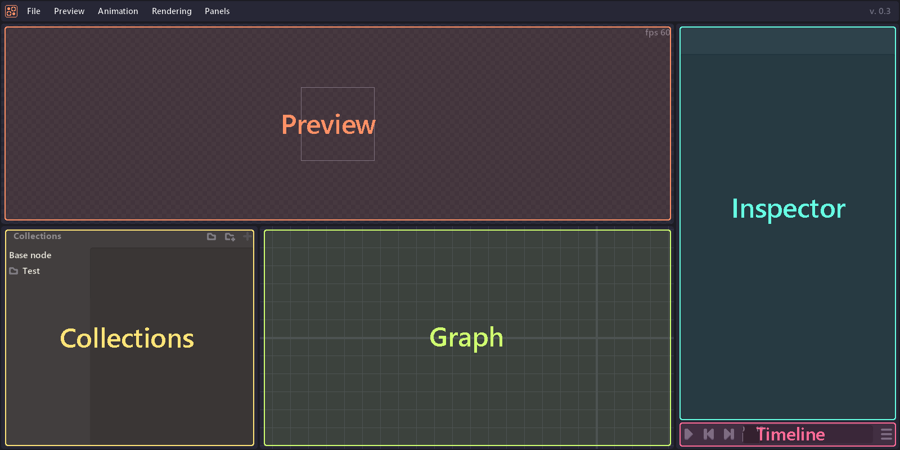
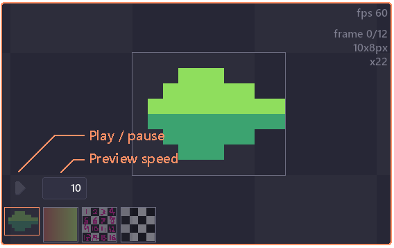
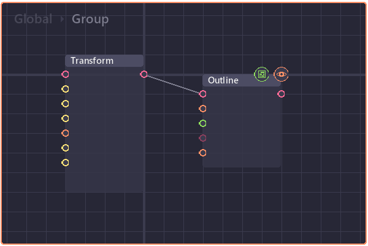
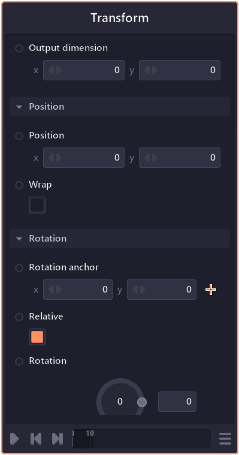
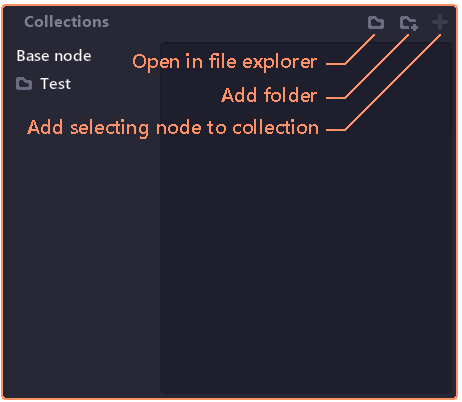

# UI

Pixel Composer is divided into panels.

When you click inside the panel, you will set focus on that panel. A focusing panel will have orange outline. Some keyboard shortcuts are context sensitive and will only trigger when a corresponding panel is focusing.

## Preview

Preview panel display the content of the previewing node. You can preview node by double clicking at the node in graph panel (or press p while focusing on graph panel)

| Operations              | Actions           |
| :---------------------- | ----------------- |
| Pan                     | Middle mouse hold |
| Zoom                    | Scroll wheel      |
| Focus (view full image) | **F**             |
| Save preview as...      | **Shift + S**     |
| Set previewing node     | Double click      |

​When previewing image array. Extra controls will appear which allow you to preview each image or play all images as an animation.

## Graph

​Graph show all nodes in current context.

| Operations              | Actions           |
| :---------------------- | ----------------- |
| Pan                     | Middle mouse hold |
| Zoom                    | Scroll wheel      |
| Focus (view full image) | **F**             |
| Import image            | **I**             |
| Import image array      | **Shift + I**     |
| Group                   | **G**             |
| Ungroup                 | **Shift + G**     |

### Graph context

When working with complex effect. You can group multiple nodes into node group. Double click on node group will change the graph context to that group and the context navigator will appear on top.

## Inspector

Inspector show properties of the focusing node. Inside inspector also contain timeline at the bottom.

| Operations               | Actions         |
| ------------------------ | --------------- |
| Copy selecting property  | **Ctrl + C**    |
| Paste selecting property | **Ctrl + V**    |
| Play / Pause animation   | **Space**       |
| Go to next frame         | **Right arrow** |
| Go to previous frame     | **Left arrow**  |
| Go to first frame        | **Home**        |
| Go to last frame         | **End**         |

## Collections

​Collection panel (toggle from panel > collections) show all node collection (pre-made nodes, node group) allowing you to add collection into current project by draging a collection and drop onto graph panel.