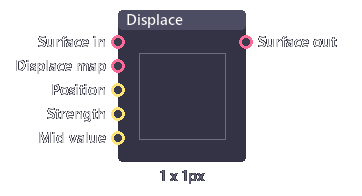
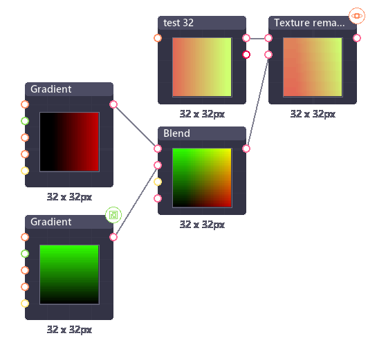
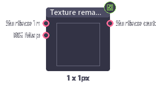
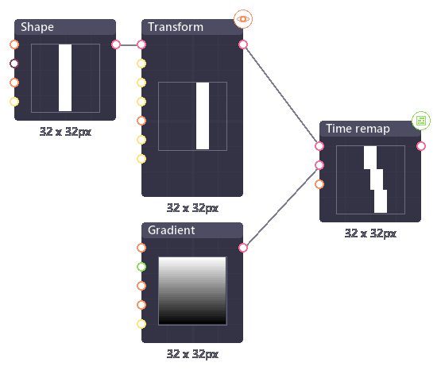
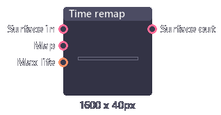
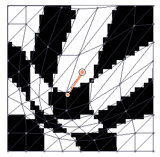
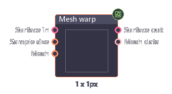

# Image distortion

This pose will cover some distortion nodes.

## Displace

Displace node shift the pixel around according to the brightness (or red and green channel) of the displace map.

| Inputs           | Type     | Description                               |
| ---------------- | -------- | ----------------------------------------- |
| Surface in       | Surface  | Image input.                              |
| Displace map     | Surface  | Displace strength map.                    |
| Position         | Float[2] | Base displacement.                        |
| Strength         | Float    | Displacement multiplication.              |
| Mid value        | Float    | Middle value to map from black to white.  |
| Use RG as vector | Boolean  | Use red and green to displace in XY axis. |
| Iterate          | Boolean  | Resample displace map every step or not.  |

| Outputs     | Type    | Description   |
| ----------- | ------- | ------------- |
| Surface out | Surface | Image output. |

## Texture remap

Texture remap use red and green channel to remap X,Y position of the image.

| Inputs     | Type    | Description       |
| ---------- | ------- | ----------------- |
| Surface in | Surface | Image input.      |
| RG Map     | Surface | Texture position. |

| Outputs     | Type    | Description   |
| ----------- | ------- | ------------- |
| Surface out | Surface | Image output. |

## Time remap

Time remap use greyscale map to displace image from the previous frames. The brighter the color is, the more delay.

| Inputs     | Type    | Description                   |
| ---------- | ------- | ----------------------------- |
| Surface in | Surface | Image input.                  |
| Map        | Surface | Time delay map.               |
| Max life   | Integer | Maximum frames (white pixel). |

| Outputs     | Type    | Description   |
| ----------- | ------- | ------------- |
| Surface out | Surface | Image output. |

## Mesh warp

Mesh warp node is a node in the transform section which allow you to warp an image using control points.
Mesh generation has to be activate manually by clicking on "Generate" button in inspector panel.

| Inputs            | Type        | Description                                          |
| ----------------- | ----------- | ---------------------------------------------------- |
| Surface in        | String      | Image input.                                         |
| Sample size       | Int         | Size (in pixel) of the grid used to subdivide image. |
| Control points... | float[5]... | Position and behavior of control points.             |

| Outputs     | Type    | Description                         |
| ----------- | ------- | ----------------------------------- |
| Surface out | Surface | Image output.                       |
| Mesh data   | Mesh    | Mesh data after the transformation. |

### Preview tools

When previewing this node, an extra toolbar will appear in preview panel.

- **Add / Remove point**: 
  - Click and drag on empty space to add control point. 
  - Click on existed control point to remove it.