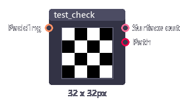
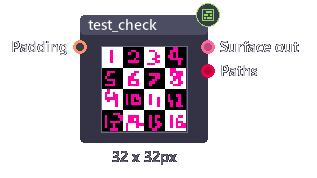
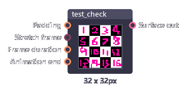
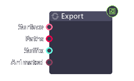

# Import-Export Image(s)

​This tutorial will go through types of images, and the nodes that use to import, export them.

## Import nodes

Image in Pixel Composer sometimes called surface. 

### Image

Image node represent a single image file.

| Inputs  | Type   | Description                           |
| ------- | ------ | ------------------------------------- |
| Path    | String | Path to an image.                     |
| Padding | Int[4] | Extra pixels added in each direction. |

| Outputs     | Type    | Description    |
| ----------- | ------- | -------------- |
| Surface out | Surface | Image output.  |
| Path        | String  | Path to image. |

### Image array node

​Image array represents multiple images in one junction. Most nodes process all images inside an array which allow you to edit multiple images at the same time.

| Inputs        | Type   | Description                                                  |
| ------------- | ------ | ------------------------------------------------------------ |
| Path          | String | Path to all images (multiple lines string).                  |
| Padding       | Int[4] | Extra pixels added in each direction.                        |
| Canvas size   | Int    | If the images have different dimensions. - **Individual**: Do nothing. - **Minimum**: Use minimum size. - **Maximum**: Use maximum size. |
| Sizing method | Int    | If the images have different dimensions. - **Padding / Crop**: Do nothing - **Scale**: Scaling image to fit the canvas. |
​
| Outputs     | Type      | Description     |
| ----------- | --------- | --------------- |
| Surface out | Surface[] | Image array.    |
| Paths       | String[]  | Array of paths. |

### Image animation node

​Image animation takes in a string of multiple paths, then output only one image depending on the current frame.

| Inputs         | Type    | Description                                                  |
| -------------- | ------- | ------------------------------------------------------------ |
| Path           | String  | Path to all images (multiple lines string).                  |
| Padding        | Int[4]  | Extra pixels added in each direction.                        |
| Stretch frame  | Boolean | Stretch animation to match the project animation length.     |
| Frame duration | Int     | Duration (in frame) of each image.                           |
| Animation end  | Int     | When animation ends. - **Loop**: Loop animation - **Ping pong**: Inverse animation - **Hold last frame**: Stop animation - **Hide**: Hide frame |

| Outputs     | Type      | Description  |
| ----------- | --------- | ------------ |
| Surface out | Surface[] | Image array. |

## Export node

​Export node allow you to save image(s) as .png file(s).

| Inputs   | Type               | Description                 |
| -------- | ------------------ | --------------------------- |
| Surface  | Surface, Surface[] | Image(s) to export.         |
| Path     | String, String[]   | Path(s) to export to.       |
| Suffix   | String             | Text added after each path. |
| Animated | Boolean            | Export animation.           |

### Suffix format

- **%f**  Current frame number.
- **%i**  Image index number (in array).
- **%d**  Path directory.
- **%n**  File name (without extension).
- **%e**  File extension.

### Exporting

​Export node does not update automatically. That means to run this node, you have to click the  icon in the inspector panel to start exporting.

