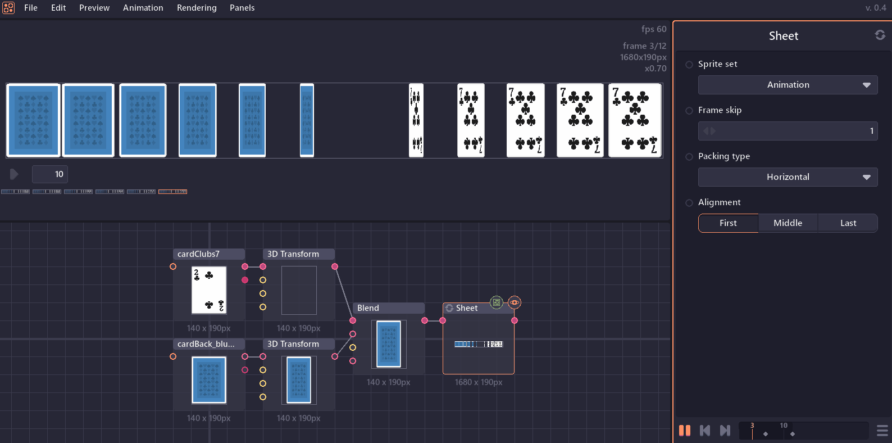

# Welcome to Pixel Composer

Pixel Composer is a node base VFX software for pixel art. With Pixel Composer, you can build complex animated visual effect procedurally.

## Download and installations

- Download .zip file at [makham.itch.io](https://makham.itch.io/pixel-composer).
- Extract the file.
- Run Pixels Composer.exe.
