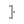
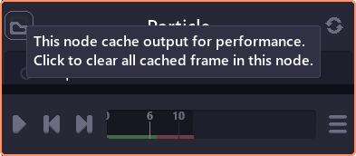
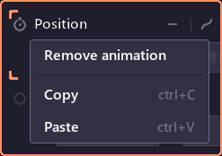
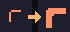
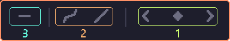

# The First Node

This page will talk about the basic of node and compositing process.

## Nodes

Node represent a single operation. Most nodes consist of inputs and outputs junctions. Some nodes have extra attribute which will appear as small icon before its name. 

-  **Manual refresh** icon means the nodes is slow or has heavy CPU usage. A change in input will only be render one you click refresh in inspector panel.
-  **Group** icon means the node is a group that can be explore inside by double click on it. 

| Operations  | Actions                                   |
| ----------- | ----------------------------------------- |
| Create node | [Graph panel] Right click on empty space. |
| Delete node | **Delete**                                |
| Group       | **G**                                     |
| Ungroup     | **Shift + G**                             |

Some node also cache previous frame for computation, when focusing on it a "clear cache" button will appear and cache status will be shown in timeline.

## Junction

Junction represent data in/out the node.

| Operations                  | Actions                                    |
| --------------------------- | ------------------------------------------ |
| Connect between 2 junctions | Left click + drag from one node to another |
| Remove connection           | Left click once on input junction          |
| Create node and connect     | Left click + drag from node to empty space |

Some junction type aren't compatible with each other. Most of the time it will leads to error, sometime value are expanded to match the output (single number to 2,3 D vector).

## Animation

This icon  arrear when a node is focusing, which means the properties of that node is being shown in inspector panel. This allow you to modify the properties directly, or edit its animation.

To animate a property, you can right click on property and select "Add animation", or click on clock icon in front of property name (v0.3+).	

When the properties is animated, you can see its keyframes in the timeline. Note that you have to select the property first (click on property until the corner become thicker)  to be able to edit keyframes.

### Animation control

When a property is animated, an extra button will appear allowing you to adjust how to animation looks.

- **Timeline control**
  - Go to previous keyframe
  - Add / remove current keyframe
  - Go to next keyframe
- **Interpolation control**
  - Interpolation curve (Linear, Quadratic, Sine, Circular, Elastic)
  - Interpolation easing (Start, End, Both)
- **Looping mode** (What todo after the last keyframe)
  - No looping
  - Loop
  - Ping pong

